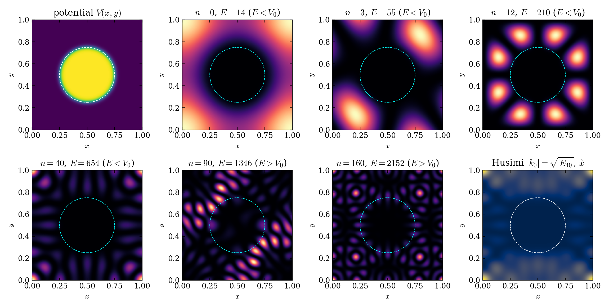

# qtorus - a penetrable Sinai billiard on the flat torus

A reproducible framework for a single quantum particle on a
flat 2-torus (a rectangular cell with doubly periodic boundary conditions)
containing one **finite-height, penetrable** circular obstacle. Unlike the
classical hard-wall Sinai billiard (recovered as the limit $V_0 \rightarrow \infty$), a finite
barrier lets the wavefunction **scatter off, penetrate, and tunnel through** the
obstacle. Barrier height $V_0$ is a single knob that tunes the system between an
integrable free torus and a chaotic dispersing billiard, and at the same time
controls quantum tunnelling.

The hard-wall torus-plus-disk is the classic Sinai billiard; its GOE
statistics and the Poisson/GOE dichotomy are well studied objects. Softened and singular
Sinai scatterers have been studied as well. See paper for references. What we aim at is
consolidation and reproducibility: the finite-height penetrable disk on the
torus as a single tunable family that couples spectral statistics and tunnelling,
delivered as open, verified, fully reproducible software.

The framework analyzes two things:

* **Spectral statistics / quantum chaos** - plane-wave (Fourier) diagonalisation,
  symmetry desymmetrisation into $C2v$ irreducible sectors, unfolding, the
  nearest-neighbour spacing distribution $P(s)$, number variance $\Sigma^2(L)$,
  spectral rigidity $\Delta_3 (L)$, and the Brody parameter. Result: a clean
  Poisson $\rightarrow$ GOE transition as $V_0$ grows.
* **Wave-packet tunnelling dynamics** - a unitary Strang split-operator (FFT)
  propagator, Gaussian packets, and in-obstacle probability. Result: a smooth
  crossover from over-barrier penetration $(E>V_0)$ to tunnelling $(E<V_0)$.





## Units and model

$\hbar=1$, mass $m = 1/2$, so $H = -\nabla^2 + V \,$ and $E = |k|^2$.
Domain $[0,Lx) \times [0,Ly)$ (periodic). Obstacle of radius $R$, height $V_0$,
centre $r_0$, with a sharp top-hat or a smooth (tanh) radial profile.
Sharp-disk Fourier coefficients are analytic (the 2-D Bessel/“disk” transform);
smooth-disk coefficients come from one FFT. Smooth is the default because a
discontinuous top-hat converges only algebraically in a plane-wave basis
(Gibbs).

## Install

```bash
pip install -r requirements.txt      # numpy, scipy, matplotlib
export PYTHONPATH=$PWD               # or: pip install -e .
```

## Quick start

```python
from qtorus import (TorusGeometry, CircularPotential, sector_hamiltonian,
                    unfold_spectrum, nnsd, brody_fit)
from scipy.linalg import eigh
import numpy as np

geom = TorusGeometry(Lx=1.0, Ly=1.6180339887, ngrid=256)      # incommensurate
pot  = CircularPotential(geom, R=0.25, V0=1000.0, center=(0,0),
                         profile="smooth", w=0.02)
Hs, _ = sector_hamiltonian(geom, pot, mmax=30, sector="A1")   # C2v block
E = np.sort(eigh(Hs, eigvals_only=True))[:320]                # converged window
s = nnsd(unfold_spectrum(E))
print("Brody beta =", brody_fit(s))
```

Dynamics:

```python
from qtorus import (TorusGeometry, CircularPotential,
                    SplitOperatorPropagator, gaussian_wavepacket)
geom = TorusGeometry(1.0, 1.0, 256)
pot  = CircularPotential(geom, R=0.12, V0=5000.0, center=(0.5,0.5),
                         profile="smooth", w=0.015)
prop = SplitOperatorPropagator(geom, pot, dt=8e-5)
psi  = gaussian_wavepacket(geom, 0.22, 0.5, sigma=0.06, kx0=50.0, ky0=0.0)
psi, times, logs = prop.evolve(psi, nsteps=130)
```

## Reproduce every figure

```bash
python scripts/fig_convergence.py     # sharp vs smooth convergence (methods)
python scripts/run_statistics.py      # Poisson -> GOE transition
python scripts/fig_eigenstates.py     # eigenstate montage + Husimi
python scripts/run_dynamics.py        # scattering/tunnelling + crossover + gif
```

Figures are written to `paper/figures/` (`mkdir` these folders or change the location in the script), and data to `data/`.

## Tests

```bash
pytest -q          # 5 independent correctness checks (see paper Table 1)
```

## Package layout

```
src/
  geometry.py     torus domain, real & reciprocal grids
  potential.py    sharp/smooth circular obstacle, analytic Bessel coefficients
  hamiltonian.py  plane-wave Hamiltonian (dense & sparse)
  solvers.py      dense / sparse shift-invert eigensolvers; FD cross-check
  symmetry.py     C2v sector projection (clean level statistics)
  dynamics.py     unitary split-operator propagator; Gaussian packets
  statistics.py   unfolding, P(s), Σ², Δ₃, Brody fit, RMT references
  husimi.py       Husimi phase-space slice
  viz.py          publication styling & plot helpers
  config.py       hashable SimulationConfig (JSON)
  provenance.py   environment/versions/seed capture
tests/            automated verification suite
scripts/          reproducing figures from the paper - one script per figure
data/             generated data JSON
```

## Scaling to a workstation / HPC

The in-repo demos are sized for a single core. Ready-to-run workstation presets
(6-core / 32 GB) live in `configs/` - see `configs/README.md` and the paper's
computational appendix for benchmarks and rationale.

Note on sparsity: for the *smooth* obstacle the Fourier coefficients stay large
across the whole grid, so the plane-wave Hamiltonian is **dense-occupancy**
(~84% filled even at `drop_tol=1e-3`). Plan for dense scaling; sparse
shift-invert offers little memory benefit here. The real levers are the four
`C2v` blocks (each ~4× smaller than the full basis) and eigenvalues-only solves.

* **Larger spectra** (`configs/A_larger_spectra.json`) - raise `mmax` and use the
  memory-lean single-sector builder, which never forms the full dense H:
  `sector_spectrum(geom, pot, mmax=90, sector="A1", n_use=4300, lean=True)`.
  Peak memory is `O(d²)` (sector), not `O(Nbasis²)`, making `mmax ~ 90–110`
  routine in 32 GB. (As-shipped `sector_hamiltonian`, which assembles the full
  dense H first, is safe to `mmax ≈ 64`.)
* **Better statistics** (`configs/B_better_statistics.json`) - diagonalise all
  four `C2v` sectors and pool their (separately unfolded) spacings with
  `pooled_nnsd`; resolve `β` in energy bands with `banded_statistics` to study
  the `E/V0` dependence of chaoticity. `mmax=70` gives ~10,000 pooled converged
  levels.
* **Finer dynamics** (`configs/C_finer_dynamics.json`) - increase `ngrid`
  (FFT cost `O(N² log N)` per step, memory-light) and reduce `dt`; use a threaded
  FFT backend (`scipy.fft.fft2/ifft2(..., workers=6)`). $1024^2-2048^2$ grids with
  1e4 steps run in minutes.

Advice. Always check convergence: compare two `mmax` values and keep only the levels
that agree (the demo keeps the lowest ~320 of ~491 converged at `mmax=30`;
~0.52 $\times$ sector dimension is a good rule of thumb).
